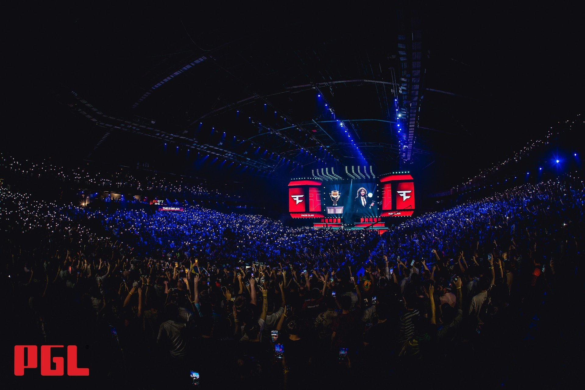
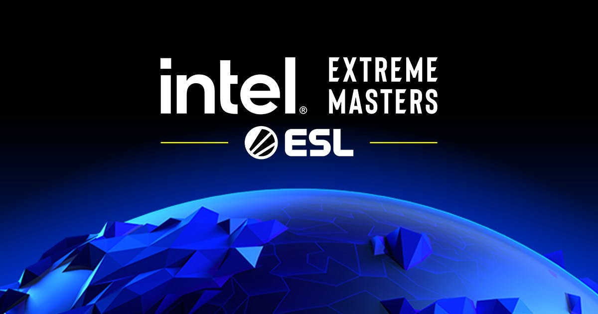
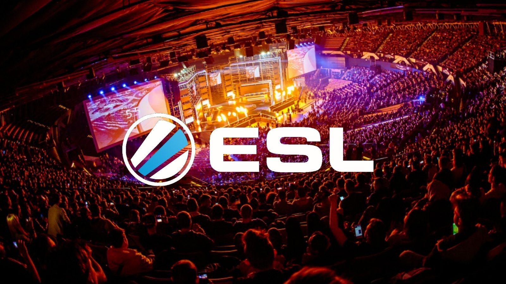
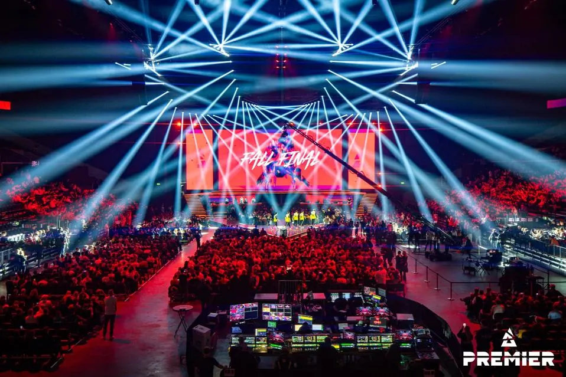

# 赛事相关

这里有关CS赛事的相关信息

### 赛事

根据[Liquipedia](https://liquipedia.net/counterstrike/Valve_Tournaments)的定义，我们这里的介绍的赛事只有三个：

1. Valve级别赛事（官方赛事 Major）

2. S级赛事（大型赛事）

3. A级赛事

#### Valve级别赛事

Valve目前只参与举办Major，Major也是所有选手最终的追求。

参与Major的选手可以在游戏中获得属于自己的战队贴纸以及签名贴纸。**每年举办两次**

类似于奥运会，由各大赛事方竞标举办。同时，进入Major八强的选手将会获得游戏内的勋章（银色），而Major冠军将会获得冠军奖杯（比如Stewie2k的2018波士顿Major冠军奖杯）

#### S级赛事

S级赛事（前身为Premier锦标赛）奖金丰厚，几乎都是线下赛、
并有来自世界各地的最佳队伍参赛。它们通常由知名的赛事方举办，在社区中享有盛誉。

#### A级赛事

A级赛事一般都是S级或者是Valve级别赛事的线下预选赛，比如说RMR（Major的预选赛）之类的。这种赛事也有许多强队也会参加。

#### 注明

有些人分不清IEM卡托维兹跟卡托维兹Major的关系。是这样的，每年卡托维兹都会举办S级比赛，但不是每一年的Major举办地都在卡托维兹这座城市。

Major是Valve放权让赛事方举办，然后自己也提供支持（比如说出贴纸，游戏内宣传）。

### 赛事方

仅统计比较知名的赛事方

#### PGL

一个比较知名的赛事方，曾举办了斯德哥尔摩Major以及安特卫普Major，CS2的第一届Major——哥本哈根Major也是他举办的。

赛事经验丰富，不过名声比较不好。

#### IEM

全称英特尔精英大师赛，为ESL旗下赛事方，赛事经验比较丰富。

#### ESL

最专业的CS赛事方，举办了很多著名的比赛。（但是Major比赛往往是PGL比较多名场面...）

#### BLAST.tv

比较能整活的一个赛事方

目前CS赛场就被这四大赛事方统治，举办大型赛事当然还有FISSURE啊、中东地区的新兴赛事方以及国内的完美世界电竞赛事方，就不多阐释了。

### HLTV.org

目前比较权威的数据机构是由丹麦人创立的门户网站HLTV.org（https://www.hltv.org/）

HLTV.org与Valve发行的GOTV前身HLTV并无任何关系，只是同名而已。

HLTV.org作为最权威的赛事数据门户网站（因其每年评选的TOP20选手往往有时候不得人心，得到了戏称**野榜**），你可以在这个网站中查询数据以及选手信息等相关信息。

当然，建议还是使用一些广告屏蔽插件再访问HLTV.org，因为实在太多不良的广告了。