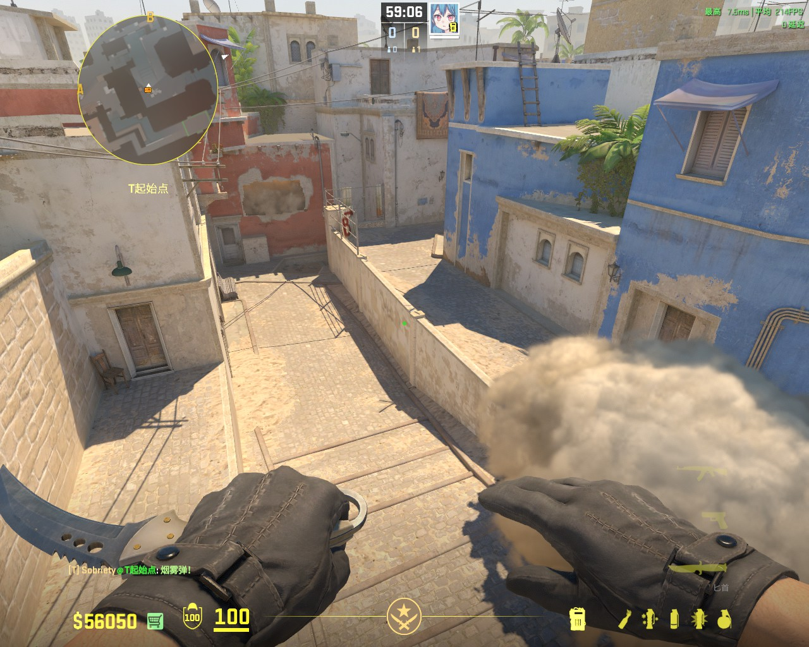
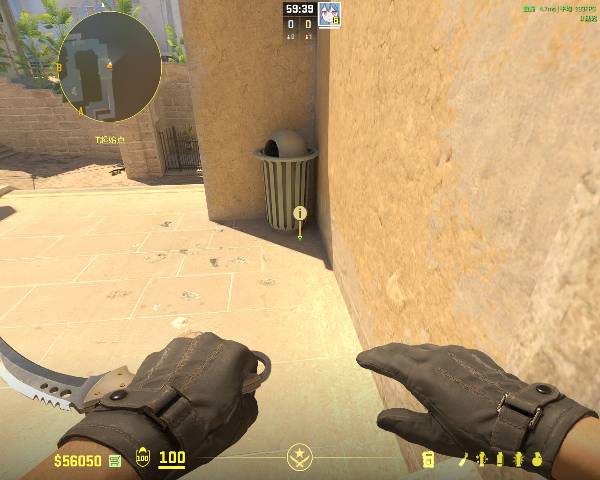
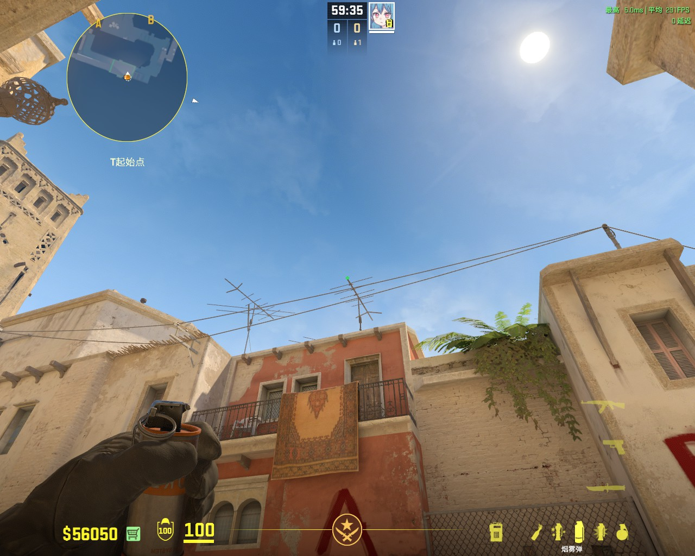
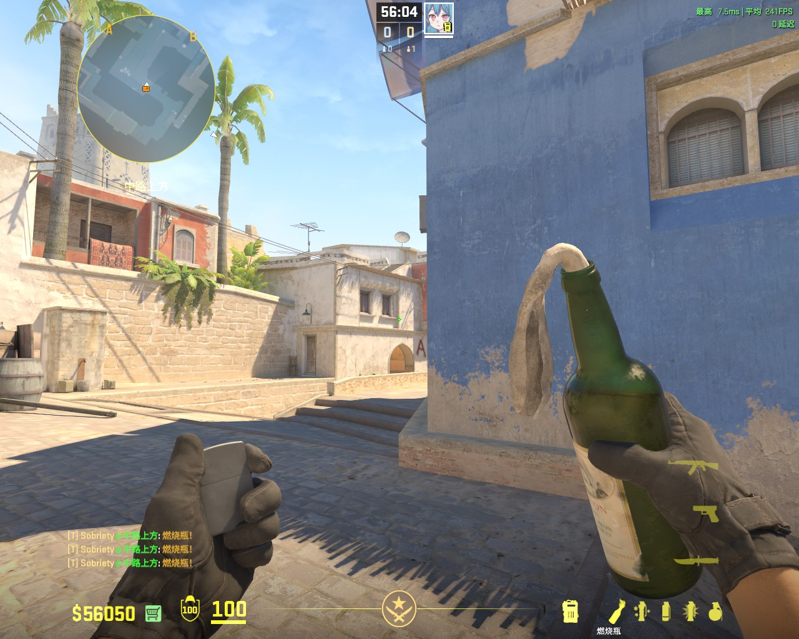
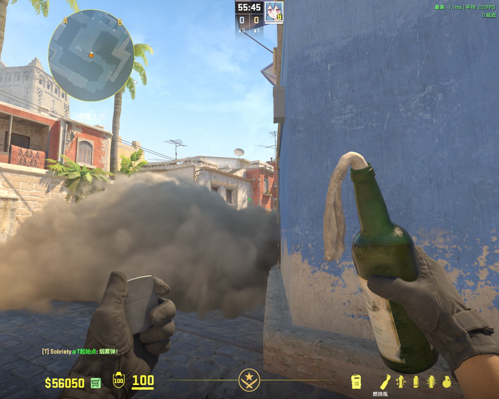
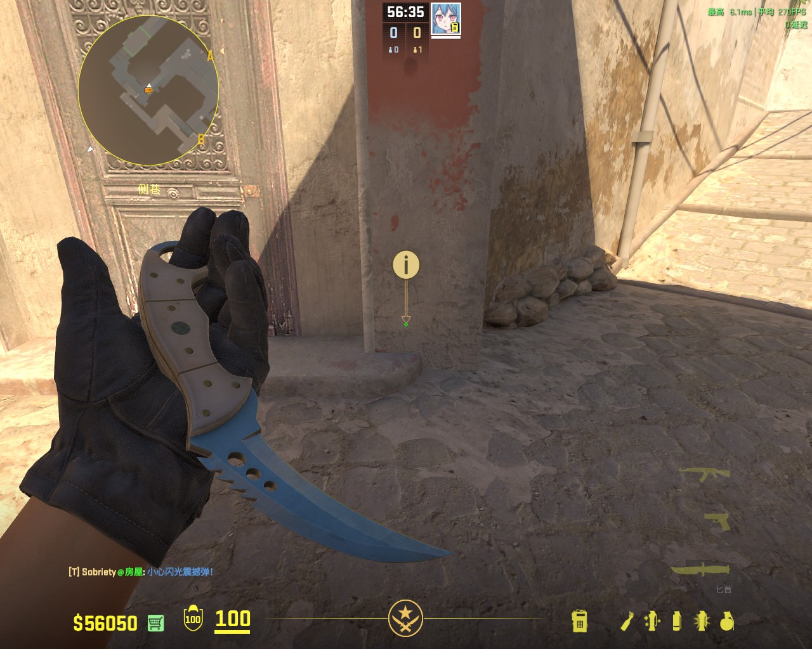
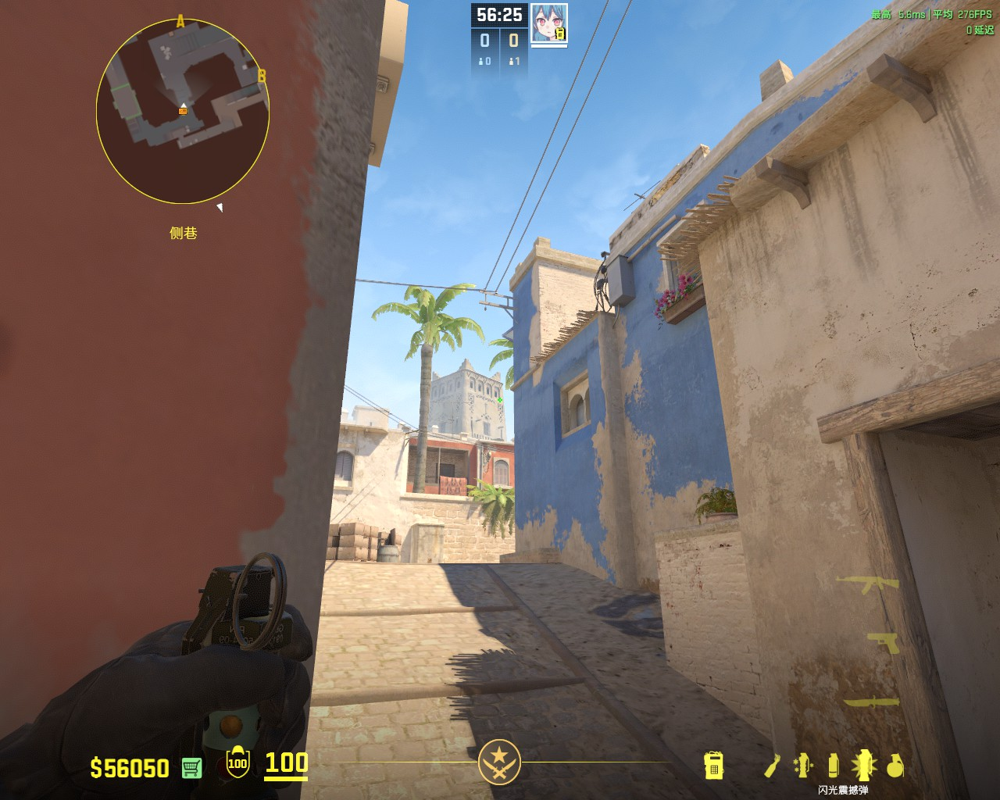
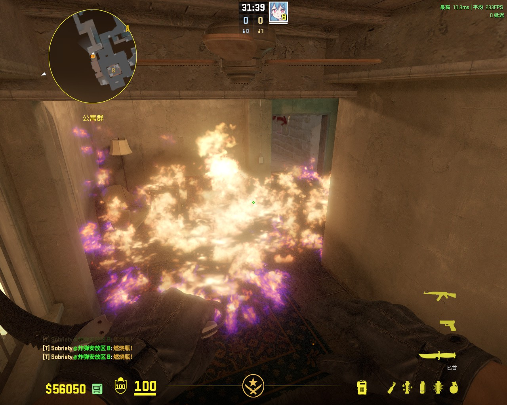
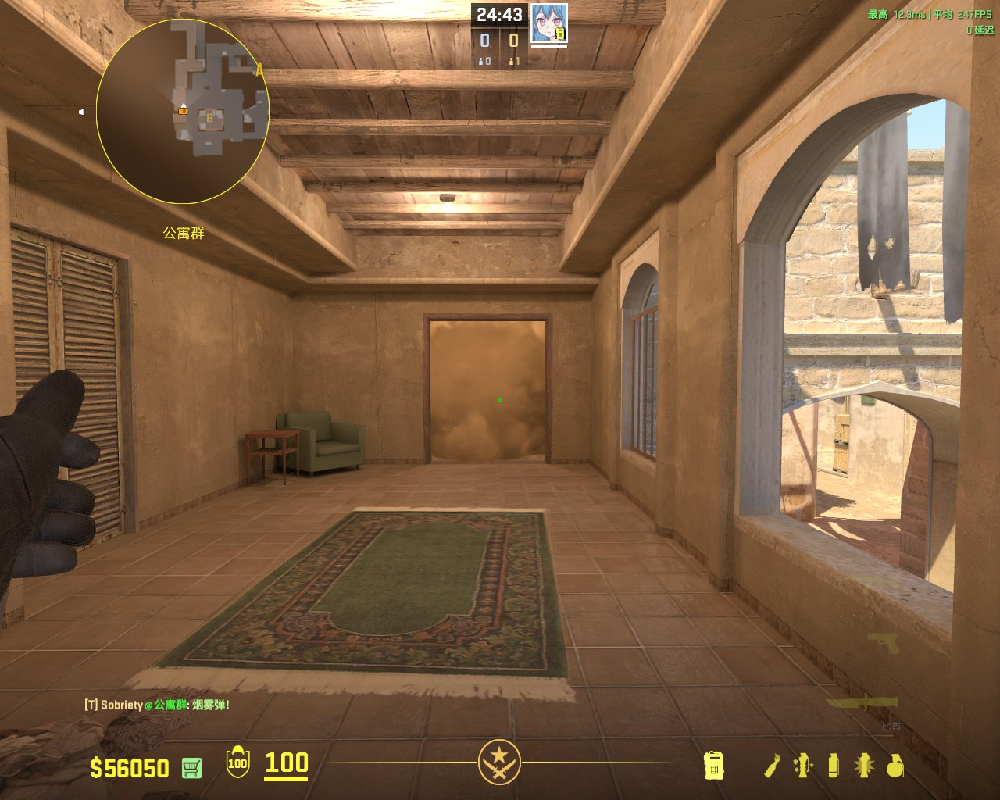
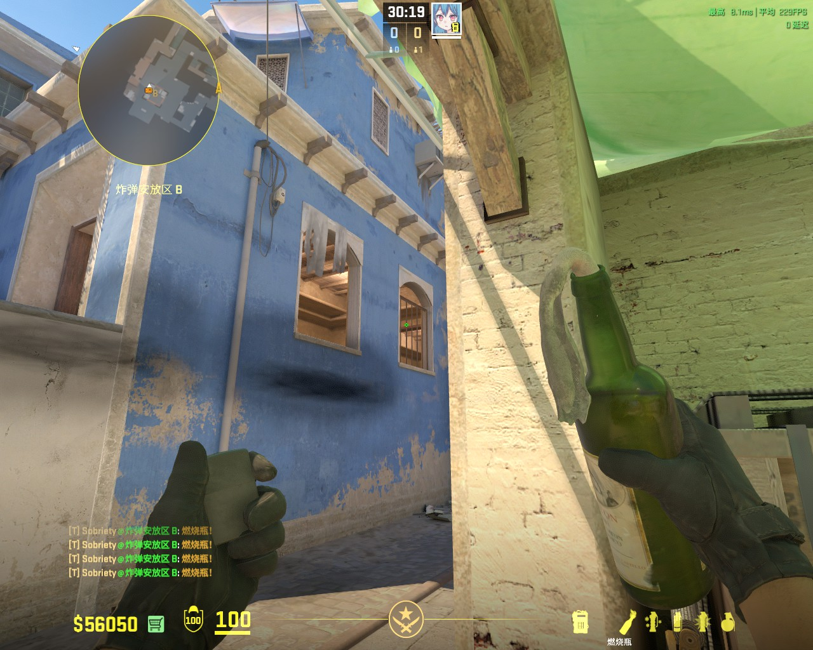

# 【OM】跟着李神学道具：荒漠迷城篇（上）

前言：李神说要有道具，于是V社便研究出了道具。

如果你要给CS划分成学院派和肌肉派两个流派，那么NAVI无疑是学院派的代表战队，而李神，更是这妙不可言的，伟大绝伦的学院派的主心骨。

作为学院派，严谨的道具加上如钢铁般的纪律性，还有精妙的既定战术是三者不可缺一的，Blad3的手下自然拥有精妙的既定战术，NAVI如今五人在李神的带领下自然获得了钢铁般的纪律性，那么，严谨的道具从何而来？

让我们点开HLTV，看一下我们的、敬爱的、伟大的李神的数值面板吧。

图片描述：92的道具评分，这在四大流量队的指挥中是排行第一的（指的是NAVI、G2、Vitality还有FaZe的指挥）

拥有这样的道具，NAVI打既定战术的时候怎能不势如破竹呢？

当然，你看到这里肯定以为这是一篇——噢，教你怎么丢，站哪里丢，瞄点是什么，教完这一套就走人的教程。

现在很多这种教程：站位、瞄点、效果。然后冠上，还不会打XX图？学会这几个道具，你就能称霸XX段位啥的。

问题是，我就算知道怎么丢，但是我也不知道丢了有什么用，什么时机丢呀。

跟着这样的虫豸教学怎么能学好呢？！来，让我们走进李神的视角，解读一下李神的道具吧。

**注：以下均为笔者自身的解读，欢迎各位的指正与纠错。**

【本片段来源于IEM科隆小组赛 NAVI vs paiN】

## 进攻方

进攻方，最重要的是闪光的配合进点以及烟火雷的针对性。

**前期道具**

NAVI的出中路是非常赏心悦目的，让我们跟随李神的视角，来观察NAVI前期在中路的道具投入吧。

***注：由于篇幅问题，VIP快烟的训练点位我会放在文章末尾，需要者自取**

NAVI在前期控制中路时，一般都会投掷最起码两颗烟，第一颗是VIP的满封烟，第二颗则是过点烟。

由此可见，在前期控制中路时，VIP烟和过点烟的重要性是非常高的。

#### 过点烟

投掷方法：左键直接投掷

投掷时机与作用：这颗烟需要你在前期控制中路时进行投掷，一般是开局就给。给出这颗烟的作用不仅能辅助你过点至中路沙袋处，还能对B小和中路前压的进行一个分割和掩护己身的作用。

特别注意：前期中路控图一般需要两个人，NAVI就是这样子，一个人在后点丢闪，一个人背闪之后跟闪贴着烟边清空中路近点。

而在长枪局，李神往往会丢一个拱门的火或者是选择封拱门烟然后选择烧下水道的火。

这就是学院派CS的严谨性，虽然大部分队伍都有，但是NAVI的默认确实是流畅无比的，拱门的火可以有效阻碍从拱门前压到中路近点的CT，而封拱门烟烧下水道火则是另一种方式，一般使用这种控图方式，NAVI说明是要对中路下狠手了。

VIP第一时间跳下下水道的CT因为火的原因无法跟拱门队友形成一个有效补枪，而拱门烟则对拱门内的其他CT进行了有效的隔断。此时，如果你看POV会发现，NAVI下水道一般都会走一个人，下水道，近点都清空了，那么能威胁到中路的只有B小了。

通过道具的配合获取图权，这是我们应该学习的。而非一味的干拉，donk枪够准吧，被道具限制针对之后就很难做出有效的反击了。（虽然他还是能杀一个）

#### 拱门火

投掷方法：瞄准大致区域直接跑一步左键投掷

投掷时机和作用：既然前文我们提到，这颗火的作用是阻碍第一时间压出来的CT，那么肯定是第一身位到中路的T负责丢这个道具，不然太靠后的身位，等你拿着火跑过去的时候，人家都已经到近点了。

#### 下水道火

投掷方法：瞄准大致区域直接跑一步左键投掷

投掷时机和作用：这颗火相较于拱门火来说可以稍晚的时候投掷，因为第一时间从VIP跳下来的T只有两条线路可以走，要么下水道，要么往中路靠。第二身位可以选择丢这个火，如果CT在下水道躲着时，可以有效的缩小他在中路的影响力，如果他选择前压，那么必定会吃到后点队友丢的辅助闪。

#### 后点队友丢的闪光

投掷方法：直接左键投掷

投掷时机和作用：前期第一身位的队友要出中路的时候，记得叫他看向沙袋处/水龙头处进行背闪，然后从沙袋前面的烟边混出去。

## 防守方

由于李神在防守方时是主防B的选手，那让我们看看李神前期是如何防RUSH的。

在身位比较靠B时，李神一般都会选择丢一颗这样的火。

丢这个火有什么用呢？设想一下，你是个第一身位的T，如果队友call了要rushB，那你是不是马不停蹄地从T出生点就提着刀跑到B2楼，此时你刚走到这个拐角时，包点内丢来了这个火，这个火把你跟队友阻断开来，此时你有两种选择：A.算了，糯了。B.坚定不移地执行战术。

此时你的队友都被火断开了，只有你一个人，那么如果队友灭火的话，那么CT是不是就很清楚地知道对面确实是要坚定不移地打B，因为他们铁了心要人跟人打补枪。

你作为CT，那么就可以推一颗烟进行自保，拖时间等待队友的回防。

如果对面没有灭火，那么将会对他们造成巨额的伤害，同时你如果手中还有一颗雷，足以让他们OUT。

然后，在丢完深火之后，李神选择跳看，等待火灭。火灭了之后，如果还没有人，那么李神就会从白车跳上B2，选择推一个比较深的烟进行防守。

#### 防RUSH火

投掷方法：瞄准大致区域直接跑一步左键投掷

投掷时机和作用：身位靠B时，跑到包点处丢这个火，然后可以听脚步，也可以选择到白车跳看对面是不是有人跑出来，如果火灭的情况下还没有人的话，你可以选择白车跳B2楼，顶到前点进行防守（因为李神是吹风机，长枪李神也会这样做，但基本都是单B跳看）

